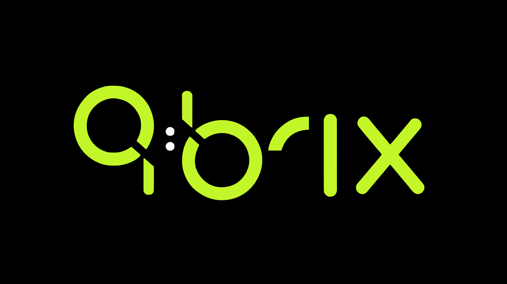

<p align="center">
  
</p>

<p align="center">
  <strong>Python SDK for the qbrix platform.</strong>
</p>

<p align="center">
  <a href="LICENSE"></a>
  
  
  
  
</p>


---

Typed sync and async clients for [Qbrix](https://qbrix.io) — pool/experiment/gate management and the agent select/feedback loop.

## Installation

The SDK speaks to the qbrix proxy over either HTTP/JSON or gRPC — pick a transport (or install both):

```bash
pip install qbrix[http]   # HTTP/JSON transport (httpx)
pip install qbrix[grpc]   # gRPC transport (grpcio)
pip install qbrix[all]    # both
```

`pip install qbrix` with no extra installs only the models and config layer — constructing a client then raises a clear `ImportError` naming the extra to add.

## Quick Start

Set your credentials as environment variables and call resources directly — no client instantiation needed:

```bash
export QBRIX_API_KEY="optiq_xxx"
export QBRIX_BASE_URL="https://cloud.qbrix.io"
```

```python
import qbrix

# 1. Create a pool of arms (variants)
pool = qbrix.pool.create(
    name="homepage-buttons",
    arms=[{"name": "blue"}, {"name": "green"}, {"name": "red"}],
)

# 2. Create an experiment with a bandit policy
exp = qbrix.experiment.create(
    name="button-color-test",
    pool_id=pool.id,
    policy="BetaTSPolicy",
)

# 3. Select an arm for a user
result = qbrix.agent.select(
    experiment_id=exp.id,
    context={"id": "user-123", "metadata": {"country": "US"}},
)
print(result.arm.name)       # "green"
print(result.is_default)     # False (bandit selected)

# 4. Send feedback (reward) after observing the outcome
qbrix.agent.feedback(request_id=result.request_id, reward=1.0)
```

The system learns from every reward and adjusts future selections automatically.

## Transports

The same `Qbrix` client, resources, and Pydantic models work over either wire format — only the transport differs:

```python
from qbrix import Qbrix

# HTTP — the qbrix cloud API
client = Qbrix(transport="http", base_url="https://cloud.qbrix.io")

# gRPC — a directly-reachable proxy (local dev shown; or an in-cluster address)
client = Qbrix(transport="grpc", base_url="grpc://localhost:50050")
```

When `transport` is omitted it's resolved in this order: the `transport=` kwarg → the `QBRIX_TRANSPORT` env var → the `base_url` scheme (`grpc://` / `grpcs://` → gRPC) → HTTP.

gRPC needs a directly-reachable proxy gRPC endpoint. The hosted cloud at `cloud.qbrix.io` is served over HTTPS behind a CDN and does **not** expose gRPC — use `transport="http"` for it. Reach for gRPC against a local proxy (`grpc://localhost:50050`) or a service deployed alongside the proxy.

The gRPC transport covers **pool, experiment, gate, agent, and policy** operations. The `runtime` resource is HTTP-only (the proxy doesn't expose it over gRPC) — calling it on a gRPC client raises `NotImplementedError`. Install `qbrix[all]` and use `transport="http"` if you need it.

## Explicit Client

For full control over configuration or lifecycle (e.g. closing the transport connection, using a context manager), instantiate the client directly:

```python
from qbrix import Qbrix

with Qbrix(api_key="optiq_xxx", base_url="https://cloud.qbrix.io") as client:
    pool = client.pool.create(
        name="homepage-buttons",
        arms=[{"name": "blue"}, {"name": "green"}, {"name": "red"}],
    )
    result = client.agent.select(experiment_id="exp-uuid", context={"id": "user-123"})
    client.agent.feedback(request_id=result.request_id, reward=1.0)
```

## Async

```python
from qbrix import AsyncQbrix

async with AsyncQbrix(api_key="optiq_xxx") as client:
    result = await client.agent.select(
        experiment_id="exp-uuid",
        context={"id": "user-456"},
    )
    await client.agent.feedback(request_id=result.request_id, reward=1.0)
```

## Configuration

Constructor kwargs take priority over environment variables, which take priority over defaults.

```bash
export QBRIX_API_KEY="optiq_xxx"
export QBRIX_BASE_URL="https://cloud.qbrix.io"
```

```python
from qbrix import Qbrix

client = Qbrix()  # picks up env vars automatically
```

| Env Var | Default | Description |
|---------|---------|-------------|
| `QBRIX_API_KEY` | `None` | API key (`optiq_xxx`) |
| `QBRIX_BASE_URL` | `http://localhost:8080` | Proxy service URL |
| `QBRIX_TRANSPORT` | _(auto)_ | `http` or `grpc` — overrides URL-scheme detection |
| `QBRIX_TIMEOUT` | `30.0` | Request timeout / gRPC deadline (seconds) |
| `QBRIX_MAX_RETRIES` | `2` | Retry count on transient failures (429/5xx, gRPC `UNAVAILABLE`) |

gRPC-only knobs: `QBRIX_GRPC_KEEPALIVE_TIME_MS` (`30000`), `QBRIX_GRPC_KEEPALIVE_TIMEOUT_MS` (`10000`), `QBRIX_GRPC_USE_TLS` (`false`).

## Feature Gates

Attach a feature gate to control rollout before the bandit kicks in:

```python
import qbrix

qbrix.gate.create(
    experiment_id=exp.id,
    enabled=True,
    rollout_percentage=80.0,
    default_arm_id=pool.arms[0].id,
    rules=[
        {"key": "plan", "operator": "==", "value": "enterprise", "arm_id": pool.arms[1].id},
    ],
)

# Gate-matched selections return is_default=True
result = qbrix.agent.select(
    experiment_id=exp.id,
    context={"id": "user-789", "metadata": {"plan": "enterprise"}},
)
print(result.is_default)  # True
```

## Error Handling

```python
import qbrix
from qbrix import NotFoundError, RateLimitedError

try:
    exp = qbrix.experiment.get("nonexistent-id")
except NotFoundError as e:
    print(f"Not found: {e.detail}")
except RateLimitedError as e:
    print(f"Retry after {e.retry_after}s")
```

## Supported Policies

| Policy             | Type        | Best For                             |
|--------------------|-------------|--------------------------------------|
| `BetaTSPolicy`     | Stochastic  | Binary rewards (clicks, conversions) |
| `GaussianTSPolicy` | Stochastic  | Continuous rewards                   |
| `UCB1TunedPolicy`  | Stochastic  | Theoretical regret guarantees        |
| `KLUCBPolicy`      | Stochastic  | Binary rewards with tight bounds     |
| `MOSSPolicy`       | Stochastic  | Fixed horizon problems               |
| `LinUCBPolicy`     | Contextual  | Linear reward models with features   |
| `LinTSPolicy`      | Contextual  | Linear models with uncertainty       |
| `EXP3Policy`       | Adversarial | Non-stationary environments          |
| `FPLPolicy`        | Adversarial | Follow the perturbed leader          |

## License

[MIT](LICENSE)
